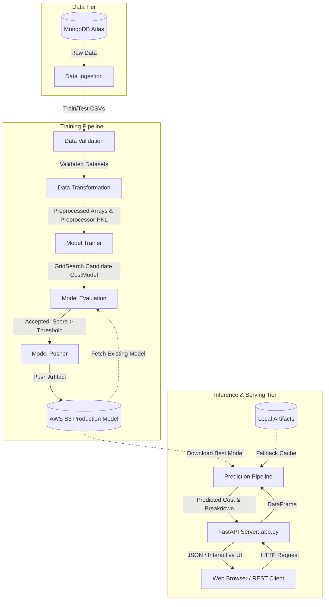

# 🗿 Sculpture & Fine Art Shipment Price Prediction (MLOps End-to-End System)

[](https://www.python.org/)
[](https://fastapi.tiangolo.com/)
[](https://scikit-learn.org/)
[](https://xgboost.readthedocs.io/)
[](https://aws.amazon.com/s3/)
[](https://www.mongodb.com/)
[](https://www.docker.com/)
[](https://opensource.org/licenses/MIT)

An enterprise-grade, production-ready Machine Learning system engineered to predict global shipping, fragile handling, customs, and transport logistics costs for high-value sculptures and fine art. Built with modular design patterns, cloud integration (MongoDB Atlas + AWS S3), automated model evaluation gatekeepers, and an interactive modern web interface.

---

## 📑 Table of Contents

- [Overview](#-overview)
- [Key Features](#-key-features)
- [System Architecture](#-system-architecture)
- [Project Directory Structure](#-project-directory-structure)
- [Dataset & Schema Specification](#-dataset--schema-specification)
- [Prerequisites & Environment Setup](#-prerequisites--environment-setup)
- [Environment Configuration](#-environment-configuration)
- [Step-by-Step Usage Guide](#-step-by-step-usage-guide)
  - [1. Training Pipeline Execution](#1-training-pipeline-execution)
  - [2. Starting the Web Application](#2-starting-the-web-application)
  - [3. REST API Usage (cURL / Python)](#3-rest-api-usage-curl--python)
  - [4. Batch Prediction with CSV](#4-batch-prediction-with-csv)
- [Testing & Quality Assurance](#-testing--quality-assurance)
- [Docker & Containerized Deployment](#-docker--containerized-deployment)
- [License & Acknowledgments](#-license--acknowledgments)

---

## 🌟 Overview

Shipping fine art and delicate sculptures is a complex logistical challenge with volatile costs driven by material fragility, volumetric weight, artist valuation, custom white-glove installation, and international customs clearance.

This repository implements an **end-to-end MLOps pipeline** that automates the lifecycle from data ingestion (MongoDB Atlas) to feature engineering, hyperparameter tuning via GridSearchCV, automated performance gating against production models in AWS S3, and real-time inference via a FastAPI web dashboard and REST API.

---

## 🚀 Key Features

- **6-Stage Modular MLOps Pipeline**:
  - `Data Ingestion`: Extracts raw records from MongoDB collections and generates stratified train/test partitions.
  - `Data Validation`: Checks schema drift, categorical cardinality, and missing data integrity.
  - `Data Transformation`: Applies IQR-based outlier capping, `ColumnTransformer` with `StandardScaler`, `OneHotEncoder`, and binary encodings.
  - `Model Trainer`: Performs multi-model grid search (`XGBoost`, `RandomForest`, `GradientBoosting`, etc.) to select optimal estimators.
  - `Model Evaluation`: Automated evaluation gatekeeper comparing candidate models against the active S3 production model with a threshold delta check.
  - `Model Pusher`: Deploys approved models encapsulated with preprocessors (`CostModel`) directly to AWS S3 bucket registries.
- **Robust Inference Engine**:
  - Real-time single quote prediction with dynamic cost breakdown estimation.
  - High-throughput batch prediction engine supporting drag-and-drop CSV files with download exports.
  - Self-healing fallback mechanism when cloud storage is offline.
- **Modern Interactive Web UI**:
  - Dark glassmorphic user interface built with HTML5, Tailwind CSS, and vanilla JS.
  - Interactive Chart.js cost distribution donut chart.
  - 1-click test preset scenarios (*Monumental Bronze*, *Ancient Marble*, *Fragile Clay*, *Handcrafted Wood*).
  - Live model retraining console with real-time log streaming.
- **Cloud & DevOps Ready**:
  - Full Docker support with multi-stage build compatibility.
  - Centralized logging (`shipment.logger`) and custom error tracing (`shipment.exception`).

---

## 🏗️ System Architecture



---

## 📂 Project Directory Structure

```text
Shipment-Price-Prediction-ML-Project/
├── config/
│   ├── model.yaml                    # Model parameter search grids & base score thresholds
│   └── schema.yaml                   # Feature definitions, types, drop & binary columns
├── shipment/
│   ├── components/                   # Core pipeline component implementations
│   │   ├── __init__.py
│   │   ├── data_ingestion.py         # MongoDB ingestion & train-test split
│   │   ├── data_validation.py        # Schema validation & drift inspection
│   │   ├── data_transformation.py    # Preprocessing, scaling & outlier capping
│   │   ├── model_trainer.py          # CostModel wrapper & GridSearchCV training
│   │   ├── model_evaluation.py       # S3 comparison gatekeeper
│   │   └── model_pusher.py           # S3 bucket model deployment
│   ├── configuration/
│   │   ├── __init__.py
│   │   ├── mongo_operations.py       # MongoDB client and collection operations
│   │   └── s3_operations.py          # AWS Boto3 S3 upload/download/query operations
│   ├── constants/
│   │   └── __init__.py               # Global constants, paths, bucket names, and keys
│   ├── entity/
│   │   ├── __init__.py
│   │   ├── artifacts_entity.py       # Dataclass artifacts passed between components
│   │   └── config_entity.py          # Dataclass configurations for each pipeline stage
│   ├── exception/
│   │   └── __init__.py               # Custom shippingException with line/file stack tracing
│   ├── logger/
│   │   └── __init__.py               # Timestamped rotational logging engine
│   ├── pipline/
│   │   ├── __init__.py
│   │   ├── training_pipeline.py      # End-to-end TrainPipeline controller
│   │   └── prediction_pipeline.py    # ShipmentData entity & PredictionPipeline engine
│   └── utils/
│       ├── __init__.py
│       └── main_utils.py             # File I/O, YAML parsing, object serialization (dill)
├── static/                           # Static assets for the Web UI
│   ├── css/
│   │   └── style.css                 # Custom glassmorphic styles & animations
│   └── js/
│       └── main.js                   # Interactive client-side logic & Chart.js rendering
├── templates/
│   └── index.html                    # Single-page web application dashboard
├── test/                             # Automated test suite
│   ├── test.py                       # Prediction pipeline & custom data unit tests
│   ├── test_model_evaluation.py      # Model evaluation gatekeeper unit tests
│   └── test_model_pusher.py          # Model pusher & S3 upload unit tests
├── app.py                            # FastAPI production web server and REST API
├── demo.py                           # Training pipeline runner script
├── Dockerfile                        # Production container image definition
├── requirements.txt                  # Python dependencies
├── setup.py                          # Packaging script for local pip installation
└── README.md                         # Project documentation
```

---

## 📊 Dataset & Schema Specification

The model consumes 14 input attributes describing the sculpture, logistics, and special handling parameters:

| Feature Name | Type | Processing Strategy | Description |
| :--- | :--- | :--- | :--- |
| `Artist Reputation` | Float | `StandardScaler` + Outlier Capping | Reputation index ranging from `0.0` to `1.0` |
| `Height` | Float | `StandardScaler` + Outlier Capping | Height in inches |
| `Width` | Float | `StandardScaler` + Outlier Capping | Width in inches |
| `Weight` | Float | `StandardScaler` + Outlier Capping | Total weight in lbs |
| `Material` | Categorical | `OneHotEncoder(handle_unknown='ignore')` | `Bronze`, `Marble`, `Wood`, `Clay`, `Brass`, `Aluminium`, `Stone` |
| `Price Of Sculpture` | Float | `StandardScaler` + Outlier Capping | Declared commercial/insured value in USD |
| `Base Shipping Price`| Float | `StandardScaler` + Outlier Capping | Base carrier logistics charge |
| `International` | Binary | `OneHotEncoder(drop='if_binary')` | Destination outside domestic borders (`Yes` / `No`) |
| `Express Shipment` | Categorical | `OneHotEncoder` | Priority transit service (`Yes` / `No`) |
| `Installation Included`| Categorical| `OneHotEncoder` | White-glove on-site assembly (`Yes` / `No`) |
| `Transport` | Categorical | `OneHotEncoder` | Carrier mode: `Airways`, `Roadways`, `Waterways` |
| `Fragile` | Categorical | `OneHotEncoder` | Custom shock-absorbing wooden crating (`Yes` / `No`) |
| `Customer Information`| Categorical| `OneHotEncoder` | Client classification: `Wealthy`, `Working Class` |
| `Remote Location` | Categorical | `OneHotEncoder` | Off-grid / specialized last-mile transit (`Yes` / `No`) |

**Target Variable**: `Cost` (Continuous float representing total shipping price in USD).

---

## ⚙️ Prerequisites & Environment Setup

### 1. Clone Repository & Setup Virtual Environment
```bash
git clone https://github.com/soumyadipjccn/Shipment-Price-Prediction-ML-Project.git
cd Shipment-Price-Prediction-ML-Project

# Create environment with Conda
conda create -n shipment python=3.11 -y
conda activate shipment
```

### 2. Install Project Dependencies
```bash
pip install -r requirements.txt
```

---

## 🔐 Environment Configuration

Create a `.env` file in the root directory:

```env
# MongoDB Atlas Connection
MONGO_DB_URL="mongodb+srv://<username>:<password>@cluster0.mongodb.net/?retryWrites=true&w=majority"

# AWS S3 Production Model Storage
AWS_ACCESS_KEY_ID="YOUR_AWS_ACCESS_KEY"
AWS_SECRET_ACCESS_KEY="YOUR_AWS_SECRET_KEY"
AWS_DEFAULT_REGION="us-east-1"
MODEL_BUCKET_NAME="shipment-price-model-bucket"
```

---

## 🚀 Step-by-Step Usage Guide

### 1. Training Pipeline Execution

Trigger the full 6-stage training and cloud deployment pipeline:

```bash
python demo.py
```

*Or invoke programmatically in Python:*
```python
from shipment.pipline.training_pipeline import TrainPipeline

pipeline = TrainPipeline()
pipeline.run_pipeline()
```

---

### 2. Starting the Web Application

Launch the FastAPI web server:

```bash
python app.py
```
*Or with Uvicorn:*
```bash
uvicorn app:app --host 0.0.0.0 --port 8080 --reload
```

- **Interactive UI**: Navigate to [`http://localhost:8080`](http://localhost:8080)
- **Interactive Swagger Docs**: Navigate to [`http://localhost:8080/docs`](http://localhost:8080/docs)

---

### 3. REST API Usage (cURL / Python)

#### Predict Single Shipment (HTTP POST `/predict`)

**cURL Request:**
```bash
curl -X POST "http://localhost:8080/predict" \
  -H "Content-Type: application/json" \
  -d '{
    "artist_reputation": 0.85,
    "height": 36.0,
    "width": 24.0,
    "weight": 350.0,
    "material": "Bronze",
    "price_of_sculpture": 18500.0,
    "base_shipping_price": 250.0,
    "international": "Yes",
    "express_shipment": "Yes",
    "installation_included": "Yes",
    "transport": "Airways",
    "fragile": "No",
    "customer_information": "Wealthy",
    "remote_location": "No"
  }'
```

**Response JSON:**
```json
{
  "status": "success",
  "predicted_cost": 3794.23,
  "formatted_cost": "$3,794.23",
  "currency": "USD",
  "breakdown": {
    "base_shipping": 250.0,
    "weight_and_dimension_fee": 226.4,
    "sculpture_insurance_fee": 555.0,
    "special_services_surcharge": 130.0,
    "international_customs_rate": "8.5%"
  },
  "timestamp": "2026-08-30 06:33:17"
}
```

**Python SDK Usage:**
```python
from shipment.pipline.prediction_pipeline import ShipmentData, PredictionPipeline

data = ShipmentData(
    artist_reputation=0.85,
    height=36.0,
    width=24.0,
    weight=350.0,
    material="Bronze",
    price_of_sculpture=18500.0,
    base_shipping_price=250.0,
    international="Yes",
    express_shipment="Yes",
    installation_included="Yes",
    transport="Airways",
    fragile="No",
    customer_information="Wealthy",
    remote_location="No"
)

pipeline = PredictionPipeline()
prediction = pipeline.predict(data.get_shipment_input_data_frame())
print(f"Predicted Shipping Cost: ${prediction[0]:,.2f}")
```

---

### 4. Batch Prediction with CSV

Upload a CSV file containing multiple shipments via the web dashboard or API:

```bash
curl -X POST "http://localhost:8080/predict_batch" \
  -F "file=@sample_shipment_data.csv"
```

The server appends a `Predicted_Cost` column and returns summary analytics with a direct download link.

---

## 🧪 Testing & Quality Assurance

Run the automated test suite covering prediction pipeline components, model evaluation gatekeepers, and S3 pusher logic:

```bash
# Prediction Pipeline & Data Formatting Tests
python test/test.py

# Model Evaluation Gatekeeper Unit Tests
python test/test_model_evaluation.py

# Model Pusher & AWS S3 Integration Unit Tests
python test/test_model_pusher.py
```

---

## 🐳 Docker & Containerized Deployment

### 1. Build Docker Image
```bash
docker build -t shipment-prediction-app:latest .
```

### 2. Run Container
```bash
docker run -d \
  -p 8080:8080 \
  --name shipment-app \
  --env-file .env \
  shipment-prediction-app:latest
```

Open [`http://localhost:8080`](http://localhost:8080) to access the application inside the container.

---

## 📜 License

Distributed under the **MIT License**. See [`LICENSE`](file:///home/user/Shipment-Price-Prediction-ML-Project/LICENSE) for full details.
